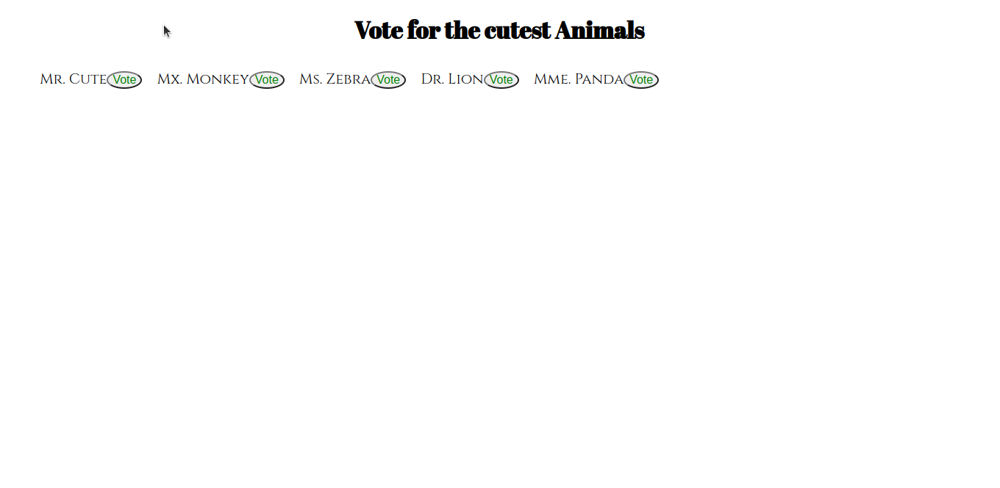

# Flataculties(codechallenge2)

#### Created By Martin Nyaga 23-6-2023

## Git Link

[Git](https://github.com/MartinNyaga/codeChallenge2)

## Description

Flataculties is a an app where you can vote for the cutest animal. Once you click on an animal name you are able to view the animal image, the number of votes and also vote for the animal.

## Setup Requirements

- Git
- Web-browser or your choice
- Github
- json server

## Development server

Run `json-server --watch db.json` for the server. Navigate to `http://localhost:3000/characters/` and the app will run on the browser. 

## Technologies Used

The following have been used on this project:

- HTML
- CSS
- JavaScript

## Screenshots 

- Homepage

  

- ItemMouseHover

  

- Votebutton MouseHover

  

- ItemOnclick value and vote count

  

## Known Bugs

when you add a vote to an animal the server is updated(patched) automaticaly but can't seem 
to do the same with the DOM object but updates after you refresh the page. will work on that soon

## Support and contact details 

To make a contribution to the code used or any suggestions you can click on the contact link and email me your suggestions.

- Email: martin.nyaga@student.moringaschool.com

## License

Copyright (c) {{ 2023 }} {{ Martin Mugendi Nyaga }}

This software is provided 'as-is', without any express or implied
warranty. In no event will the authors be held liable for any damages
arising from the use of this software.

Permission is granted to anyone to use this software for any purpose,
including commercial applications, and to alter it and redistribute it
freely, subject to the following restrictions:

   1. The origin of this software must not be misrepresented; you must not
   claim that you wrote the original software. If you use this software
   in a product, an acknowledgment in the product documentation would be
   appreciated but is not required.

   2. Altered source versions must be plainly marked as such, and must not be
   misrepresented as being the original software.

   3. This notice may not be removed or altered from any source
   distribution.
